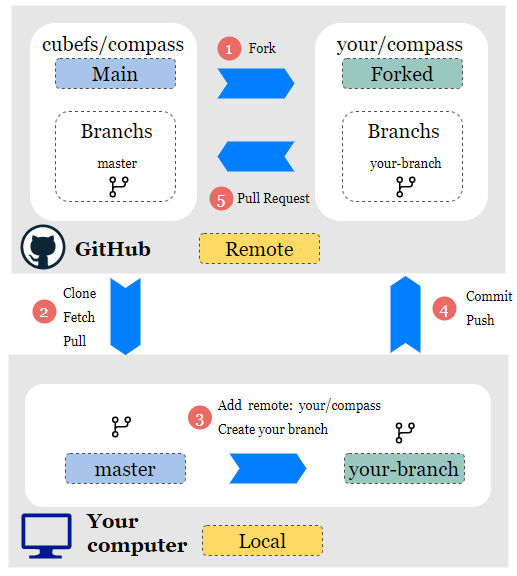

# Contributing to Compass
## Issue Reports
Please make sure the issue is not already reported by [search the repository](https://github.com/cubefs/compass/issues) with reasonable keywords. Then open an issue with steps to reproduce.

## Workflow
Recommend the standard GitHub flow based on forking and pull requests as the following basic process of contribute code to Compass:


1. Fork Compass to your repository.
2. Clone the repository to your computer, if you have already cloned it, just pull or fetch to update the code.<br>
   Example: `git clone https://github.com/cubefs/compass.git` or `git checkout main && git pull`
3. Add remote for your forked repository and create your branch.<br>
   Example: `git remote add me https://github.com/your/compass` and `git checkout -b your-branch`
4. Update the code in your branch, commit and push the code to your remote repository.<br>
   Example: `git commit -m "xxx comment" && git push me`
5. Make a pull request that request merging your own branch on your forked repository into the master branch of the main repository.<br>
   Example: merge `your/compass:your-branch` into `cubefs/compass:main`

**Note:**<br>
If your pull request solves an existing issue or implements a feature request with an existing issue. Please use the fixes keyword in the pull request to associate the pull request with the relevant issue.
- If there is an issue, you need to link to related issues.
> For example
```
fix: fix parsing hadoop log(#8)
docs: update unless doc (#11)
feat: add new feature xxx (#22)
refactor: refactor the code (#13)
chore: format yaml file. (#12)
```
