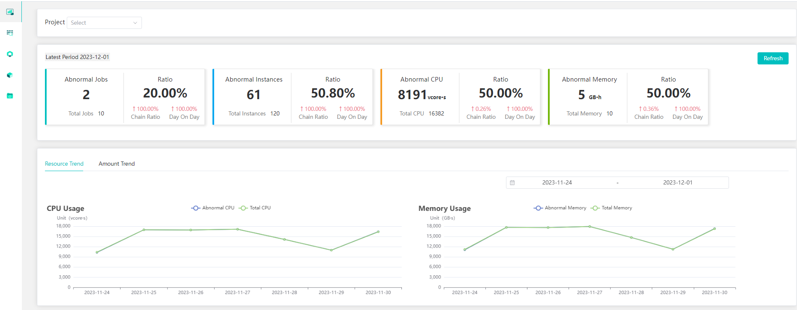
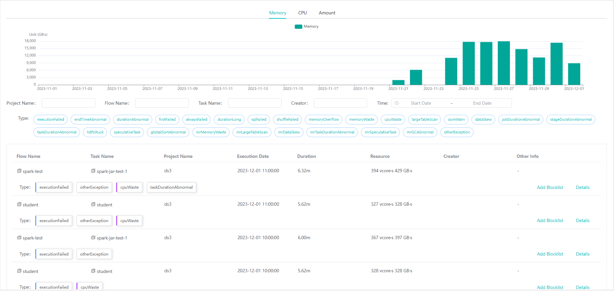
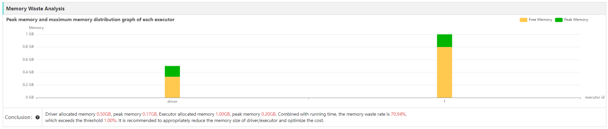

# Compass
[Chinese Document](README_zh.md)

### Abstract
Compass is a platform to diagnose computing engines and schedulers around big data ecosystem, which aims to improve the 
efficiency of troubleshooting and reduce the complexity of problem tuning. It automatically gathers logs and metrics,
runs with heuristic rules to identify problem and offers tuning advice.

### Feature
1. Non-invasive, in-time diagnosis, no need to modify the original platform code.
2. Compatible with multiple version for different componts such Spark 2.4+、Flink 1.2+、Hadoop 2.4+, DolphinScheduler 2.x+, Airflow, etc.
3. Supports diagnostics for kinds of scheduling job issues, such as failure, abnormal elapsed time, abnormal baseline, etc.
4. Supports diagnostics for kinds of engine task issues, such as data skew, big table scan,  memory waste, long tail task, etc.
5. Supports diagnostics for capturing log exception and offers advise or solution.

### Engine Support
- [x] Spark
- [x] Flink
- [x] Mapreduce
- [ ] Trino
- [ ] Other(Any suggestions are welcomed, high valued)...

### Scheduler Support
- [x] Airflow
- [x] DolphinScheduler
- [ ] Azkaban
- [ ] Oozie
- [ ] Other(Any suggestions are welcomed, high valued)...

###  Documents

[Deployment document](document/manual/deployment.md)

[Architecture document](document/manual/architecture.md)

### Community
Welcome to join the community for the usage or development of Compass.
- Submit an [issue](https://github.com/cubefs/compass/issues).
- Submit a pull request, please read the [contributing guideline](https://github.com/cubefs/compass/blob/main/CONTRIBUTING.md).
- Discuss [idea & question](https://github.com/cubefs/compass/discussions).

Usually We will reply it quickly.

### Categories of Diagnosis

| Category                      | Scope           | Dimension           | Description                                                                                             |
|-------------------------------|-----------------|---------------------|---------------------------------------------------------------------------------------------------------|
| Failed task                   | Scheduler       | Runtime Analysis    | Fail to run task successfully after retrying per running cycle                                          |
| First failed task             | Scheduler       | Runtime Analysis    | Fail to run task first time but succeed after retrying per running cycle                                |
| Long-term failed task         | Scheduler       | Runtime Analysis    | Keep failing to run task every running cycle                                                            |
| Exceed base-time task         | Scheduler       | Time Analysis       | The run ends earlier or later than normal                                                               |
| Abnormal time-elapsed task    | Scheduler       | Time Analysis       | The elapsed time of task is either too short or too long compared to the normal                         |
| Long time-consuming task      | Scheduler       | Time Analysis       | The elapsed time of task is exceed 2 hours                                                              |
| Failed SQL task               | Spark           | Runtime Analysis    | Failed to run sql                                                                                       |
| Shuffle failed task           | Spark           | Runtime Analysis    | Failed to run task due to being unable to shuffle successfully                                          |
| Memory Overflow               | Spark           | Runtime Analysis    | There is not enough memory to run task                                                                  |
| CPU waste                     | Spark,MapReduce | Resource Analysis   | The usage of CPU is not high                                                                            |
| Memory waste                  | Spark           | Resource Analysis   | The usage of Memory is not high                                                                         |
| Large table scan              | Spark,MapReduce | Efficiency Analysis | Scan too many rows of large table due to no partitions or no filters                                    |
| Memory overflow warning       | Spark           | Efficiency Analysis | The size or rows of data broadcast from driver to executor is too many, which may cause memory overflow |
| Data skew                     | Spark,MapReduce | Efficiency Analysis | The maximum data each processing unit(task/map/reduce) is larger than the median                        |
| Abnormal time-consuming job   | Spark           | Efficiency Analysis | There is a higher ratio of idle time during the run of the job                                          |
| Abnormal time-consuming stage | Spark           | Efficiency Analysis | There is a higher ratio of idle time during the run of the stage                                        |
| Long tail task                | Spark,MapReduce | Efficiency Analysis | The maximum running time of a processing unit(task/map/reduce) is much larger than the median           |
| Hdfs read/write stuck         | Spark           | Efficiency Analysis | The rate of processing data each task is much slower than that in a normal stage                        |
| Speculative tasks             | Spark,MapReduce | Efficiency Analysis | There are too many speculative tasks because of the executor is processing slowly                       |
| Abnormal global sort          | Spark           | Efficiency Analysis | The whole Spark application contains only one task                                                      |
| Abnormal gc                   | MapReduce       | Efficiency Analysis | There is a higher ratio gc time compared to CPU time                                                    |
| High memory usage             | Flink           | Resource Analysis   | The usage of the memory is high                                                                         |
| Low memory usage              | Flink           | Resource Analysis   | The usage of the memory is low                                                                          |
| Abnormal jobmanager memory    | Flink           | Resource Analysis   | The memory of jobmanager is abnormal if there is too many taskmanager                                   |
| No data processing            | Flink           | Resource Analysis   | There is no data processing in a job                                                                    |
| No data in partial task       | Flink           | Resource Analysis   | There is no data processing in partial taskmanagers                                                     |
| Optimize taskmanager memory   | Flink           | Resource Analysis   | Optimize the memory of taskmanager due to the abnormal memory given                                     |
| Not enough Parallel           | Flink           | Resource Analysis   | There is less parallel for flink job                                                                    |
| High CPU usage                | Flink           | Resource Analysis   | The usage of the CPU is high                                                                            |
| Low CPU usage                 | Flink           | Resource Analysis   | The usage of the CPU is low                                                                             |
| High Maximum CPU usage        | Flink           | Resource Analysis   | The peek of the CPU is high                                                                             |
| Slow operators                | Flink           | Runtime Analysis    | There are slow operators in a flink job                                                                 |
| Back pressure                 | Flink           | Runtime Analysis    | There is back pressure in a flink job                                                                   |
| High delay                    | Flink           | Runtime Analysis    | There is high delay in a flink job                                                                      |

### UI

### License

Compass is licensed under the [Apache License, Version 2.0](http://www.apache.org/licenses/LICENSE-2.0) For detail
see [LICENSE](LICENSE) and [NOTICE](NOTICE).

### Reference
The Drain algorithm is based on `logpai` project, for more please see 
- [https://github.com/logpai/Drain3](https://github.com/logpai/Drain3)
- [https://jiemingzhu.github.io/pub/pjhe_icws2017.pdf](https://jiemingzhu.github.io/pub/pjhe_icws2017.pdf)
