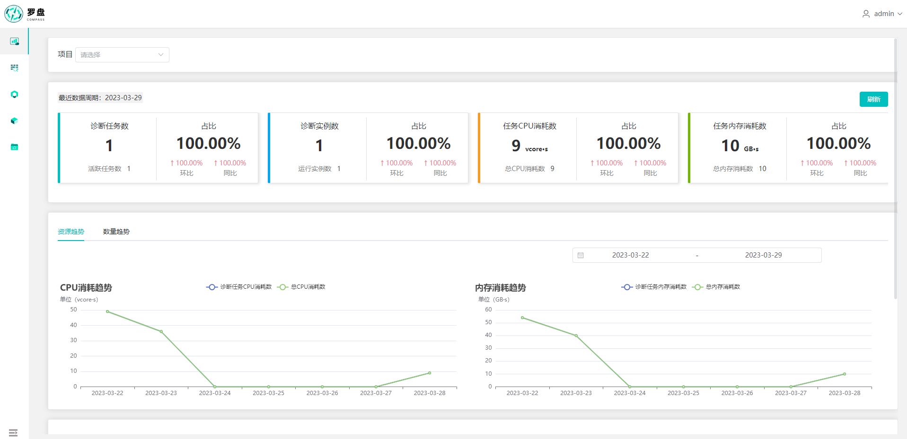
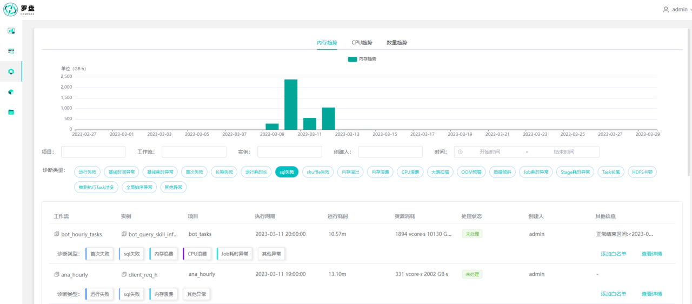
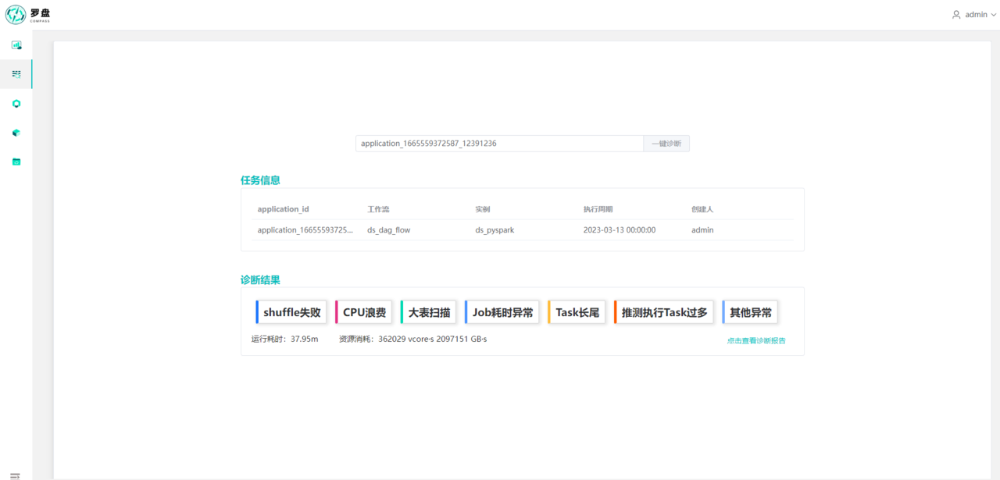
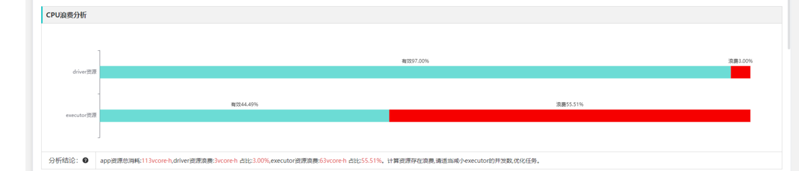
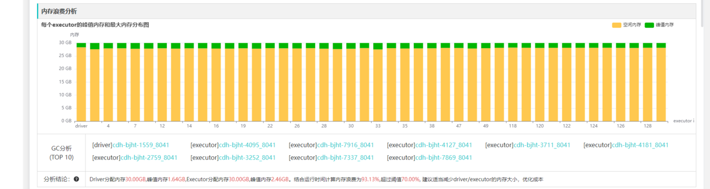
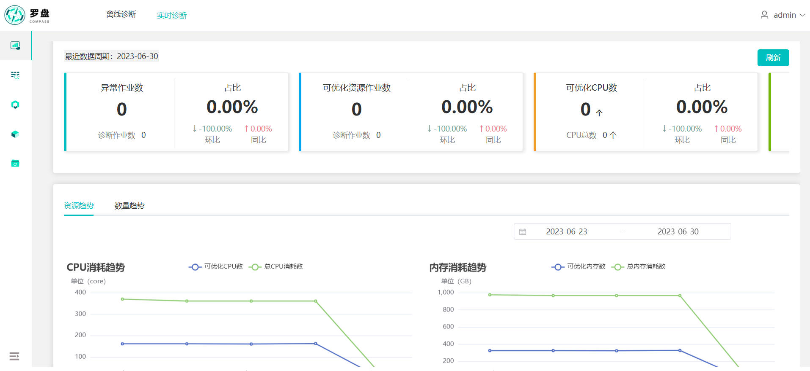
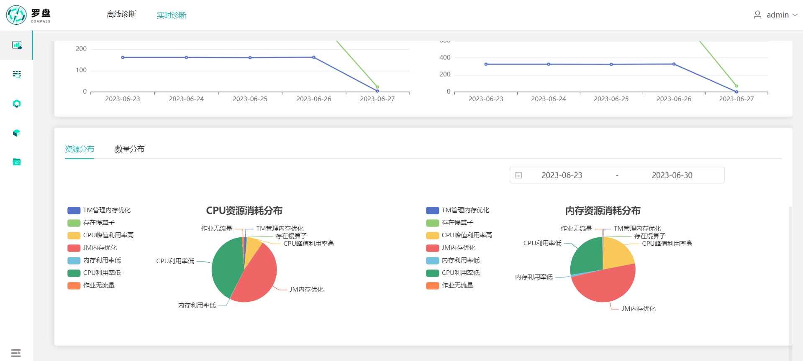
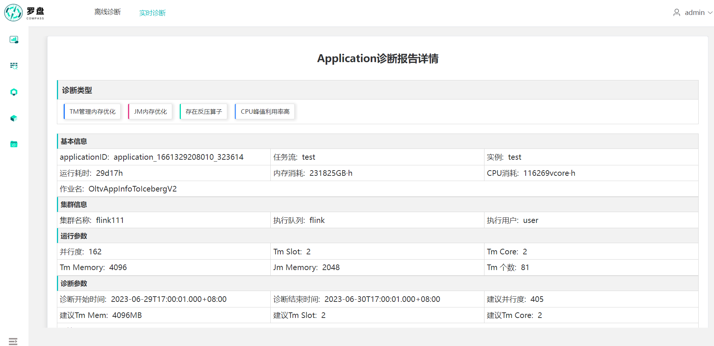

# Compass

[中文文档](README_zh.md)

Compass is a big data task diagnosis platform, which aims to improve the efficiency of user troubleshooting and reduce
the cost of abnormal tasks for users.

The key features:

- Non-invasive, instant diagnosis, you can experience the diagnostic effect without modifying the existing scheduling
  platform.

- Supports multiple scheduling platforms(DolphinScheduler 2.x or 3.x, Airflow, or self-developed etc.)

- Supports Spark 2.x or 3.x,Flink, Hadoop 2.x or 3.x troubleshooting.

- Supports workflow layer exception diagnosis, identifies various failures and baseline time-consuming abnormal
  problems.

- Supports Spark engine layer exception diagnosis, including 14 types of exceptions such as data skew, large table scanning,
  and memory waste.

- Supports various log matching rule writing and abnormal threshold adjustment, and can be optimized according to actual
  scenarios.

- Supports Flink engine layer resource and exception diagnosis,such as low memory utilization,low cpu utilization.

Compass has supported the concept of diagnostic types:

<table>
     <tr>
         <td>Engine</td>
         <td>Diagnostic Dimensions</td>
         <td>Diagnostic Type</td>
         <td>Type Description</td>
     </tr>
     <tr>
         <td rowspan="20">Spark</td>
         <td rowspan="3">Failure analysis</td>
         <td>Run failure</td>
         <td>Tasks that ultimately fail to run</td>
     </tr>
     <tr>
         <td>First failure</td>
         <td>Tasks that have been retried more than once</td>
     </tr>
     <tr>
         <td>Long term failure</td>
         <td>Tasks that have failed to run in the last ten days</td>
     </tr>
     <tr>
         <td rowspan="3">Time analysis</td>
         <td>Baseline time abnormality</td>
         <td>Tasks that end earlier or later than the historical normal end time</td>
     </tr>
     <tr>
         <td>Baseline time-consuming abnormality</td>
         <td>Tasks that run for too long or too short relative to the historical normal running time</td>
     </tr>
     <tr>
         <td>Long running time</td>
         <td>Tasks that run for more than two hours</td>
     </tr>
     <tr>
         <td rowspan="3">Error analysis</td>
         <td>SQL failure</td>
         <td>Tasks that fail due to SQL execution issues</td>
     </tr>
     <tr>
         <td>Shuffle failure</td>
         <td>Tasks that fail due to shuffle execution issues</td>
     </tr>
     <tr>
         <td>Memory overflow</td>
         <td>Tasks that fail due to memory overflow issues</td>
     </tr>
     <tr>
         <td rowspan="2">Resource analysis</td>
         <td>Memory waste</td>
         <td>Tasks with a peak memory usage to total memory ratio that is too low</td>
     </tr>
     <tr>
         <td>CPU waste</td>
         <td>Tasks with a driver/executor calculation time to total CPU calculation time ratio that is too low</td>
     </tr>
     <tr>
         <td rowspan="9">Efficiency analysis</td>
         <td>Large table scanning</td>
         <td>Tasks with too many scanned rows due to no partition restrictions</td>
     </tr>
     <tr>
         <td>OOM warning</td>
         <td>Tasks with a cumulative memory of broadcast tables and a high memory ratio of driver or executor</td>
     </tr>
     <tr>
         <td>Data skew</td>
         <td>Tasks where the maximum amount of data processed by the task in the stage is much larger than the median</td>
     </tr>
     <tr>
         <td>Job time-consuming abnormality</td>
         <td>Tasks with a high ratio of idle time to job running time</td>
     </tr>
     <tr>
         <td>Stage time-consuming abnormality</td>
         <td>Tasks with a high ratio of idle time to stage running time</td>
     </tr>
     <tr>
         <td>Task long tail</td>
         <td>Tasks where the maximum running time of the task in the stage is much larger than the median</td>
     </tr>
     <tr>
         <td>HDFS stuck</td>
         <td>Tasks where the processing rate of tasks in the stage is too slow</td>
     </tr>
     <tr>
         <td>Too many speculative execution tasks</td>
         <td>Tasks in which speculative execution of tasks frequently occurs in the stage</td>
     </tr>
     <tr>
         <td>Global sorting abnormality</td>
         <td>Tasks with long running time due to global sorting</td>
     </tr>
    <tr>
        <td rowspan="6">MapReduce</td>
        <td rowspan="1">Resource analysis</td>
        <td>Memory waste</td>
        <td>Tasks with a peak memory usage to total memory ratio that is too low</td>
    </tr>
    <tr>
        <td rowspan="5">Efficiency analysis</td>
        <td>Large table scanning</td>
        <td>Tasks with too many scanned rows</td>
    </tr>
    <tr>
        <td>Task long tail</td>
        <td>Tasks where the maximum running time of the task in the map/reduce is much larger than the median</td>
    </tr>
    <tr>
        <td>Data skew</td>
        <td>Tasks where the maximum amount of data processed by the task in the  map/reduce is much larger than the median</td>
    </tr>
    <tr>
        <td>Too many speculative execution tasks</td>
        <td>Tasks in which speculative execution of tasks frequently occurs in the map/reduce</td>
    </tr>
    <tr>
        <td>GC abnormal</td>
        <td>Tasks with a high ratio of GC time to CPU time</td>
    </tr>
    <tr>
          <td rowspan="20">Flink</td>
          <td rowspan="10">Resource analysis</td>
          <td>High memory utilization</td>
          <td>Calculates the utilization of memory, if it's higher than threshold,then increase the memory config</td>
    </tr>
    <tr>
          <td>Low memory utilization</td>
          <td>Calculates the utilization of memory, if it's lower than threshold,then decrease the memory config</td>
    </tr>
    <tr>
          <td>Job manager memory</td>
          <td>Calculates the memory of job manager according to tm numbers</td>
    </tr>
    <tr>
          <td>Job no data flow</td>
          <td>Calculates if the job has no data flow</td>
    </tr>
    <tr>
          <td>Task manager manage memory optimization</td>
          <td>Calculates manage memory utilization of job, give the advice of manage memory config</td>
    </tr>
    <tr>
          <td>Task managers run without data flow</td>
          <td>Calculates if a part of task managers running without data flow</td>
    </tr>
    <tr>
          <td>Parallel not enough</td>
          <td>Calculates whether the parallel of job is not enough</td>
    </tr>
    <tr>
          <td>Cpu utilization high</td>
          <td>Calculates the cpu utilization of job, if it's higher than threshold then increase the cpu config</td>
    </tr>
    <tr>
          <td>Cpu utilization low</td>
          <td>Calculates the cpu utilization of job, if it's lower than threshold then decrease the cpu config</td>
    </tr>
    <tr>
          <td>Cpu peek utilization high</td>
          <td>Calculates the peek cpu utilization of job, if it's higher than threshold then increase the cpu config</td>
    </tr>
    <tr>
          <td rowspan="3">Exception analysis</td>
          <td>Slow vertices</td>
          <td>Calculates if the job has slow vertices</td>
    </tr>
    <tr>
          <td>Back pressure</td>
          <td>Calculates if the job has back pressure</td>
    </tr>
    <tr>
          <td>High delay</td>
          <td>Calculates if the job has high data delay</td>
    </tr>
</table>

## Get Started

Use JDK 8 and maven 3.6.0+ to Compile

### 1. Compile

```
git clone https://github.com/cubefs/compass.git
cd compass
mvn package -DskipTests
```

### 2. Configure

```shell
cd dist/compass

vi bin/compass_env.sh
# Scheduler MySQL
export SCHEDULER_MYSQL_ADDRESS="ip:port"
export SCHEDULER_MYSQL_DB="scheduler"
export SCHEDULER_DATASOURCE_USERNAME="user"
export SCHEDULER_DATASOURCE_PASSWORD="pwd"
# Compass MySQL
export COMPASS_MYSQL_ADDRESS="ip:port"
export COMPASS_MYSQL_DB="compass"
export SPRING_DATASOURCE_USERNAME="user"
export SPRING_DATASOURCE_PASSWORD="pwd"
# Kafka (default version: 3.4.0)
export SPRING_KAFKA_BOOTSTRAPSERVERS="ip1:port,ip2:port"
# Redis (cluster mode)
export SPRING_REDIS_CLUSTER_NODES="ip1:port,ip2:port"
# Zookeeper (default version: 3.4.5, used by canal)
export SPRING_ZOOKEEPER_NODES="ip1:port,ip2:port"
# Elasticsearch (default version: 7.17.9)
export SPRING_ELASTICSEARCH_NODES="ip1:port,ip2:port"
# Flink metric prometheus
export FLINK_PROMETHEUS_HOST="host"
export FLINK_PROMETHEUS_TOKEN=""
export FLINK_PROMETHEUS_DATABASE=""
```
```shell
vi conf/application-hadoop.yml
hadoop:
  namenodes:
    - nameservices: logs-hdfs # the value of dfs.nameservices
      namenodesAddr: [ "machine1.example.com", "machine2.example.com" ] # the value of dfs.namenode.rpc-address.[nameservice ID].[name node ID]
      namenodes: [ "nn1", "nn2" ] # the value of dfs.ha.namenodes.[nameservice ID]
      user: hdfs
      password:
      port: 8020
      # scheduler platform hdfs log path keyword identification, used by task-application
      matchPathKeys: [ "flume" ]
      # kerberos
      enableKerberos: false
      # /etc/krb5.conf
      krb5Conf: ""
      # hdfs/*@EXAMPLE.COM
      principalPattern:  ""
      # admin
      loginUser: ""
      # /var/kerberos/krb5kdc/admin.keytab
      keytabPath: ""

  yarn:
    - clusterName: "bigdata"
      resourceManager: [ "machine1:8088", "machine2:8088" ] # the value of yarn.resourcemanager.webapp.address
      jobHistoryServer: "machine3:19888" # the value of mapreduce.jobhistory.webapp.address

  spark:
    sparkHistoryServer: [ "machine4:18080" ] # the value of spark.history.ui

```

### 3. Initialize the database and tables

The Compass table structure consists of two parts, one is compass.sql, and the other is a table that depends on the scheduling platform (dolphinscheduler.sql or airflow.sql, etc.)

1. Please execute document/sql/compass.sql first

2. If you are using the DolphinScheduler scheduling platform, please execute document/sql/dolphinscheduler.sql(It needs to be modified according to the actual version used); if you are using the Airflow scheduling platform, please execute document/sql/airflow.sql(It needs to be modified according to the actual version used)

3. If you are using a self-developed scheduling platform, please refer to the [task-syncer](document/manual/deployment.md#task-syncer) module to determine the tables that need to be synchronized

### 4. Deploy

```
./bin/start_all.sh
```

### 5. Flink Custom metadata
Third party system can send flink metadata to compass by kafka stream or http API, user do not have to run canal to capture 
metadata from scheduler. the format of metadata as following: 

format parameter:
```json
{
    // fields required
    "startTime":"2023-06-01", // job startrd time
    "projectName":"test", // project name
    "flowName":"test", // flow name
    "taskName":"test", // task name
    "jobName":"job_name", // job name
    "username":"test",  // user name
    "flinkTrackUrl":"tracking url", // job tracking url
    "taskState":"RUNNING", // running state
    "parallel":150, // job parallel
    "tmSlot":1, // tm slot
    "tmCore":2, // tm core
    "jmMem":1024, // jobmanager memory MB
    "tmMem":4096, // taskmanager memory MB
  
    // fields optionally required 
    "userId":1,  // user id from scheduler
    "projectId":1, // project id
    "flowId":1, // flow id
    "taskId":1, // task id
    "taskInstanceId":1, // task instance id
    "executionTime":"2023-06-01", // execution time
    "allocatedMb":1, // yarn allocated memory
    "allocatedVcores":1, // yarn allocated core
    "runningContainers":1, // running containers
    "engineType":"flink", // engine type
    "duration":"1", // job duration time
    "endTime":"2023-06-01", // job end time
    "vcoreSeconds":1, // job vcore seconds
    "memorySeconds":1, // job memory seconds
    "queue":"flink", // yarn queue
    "clusterName":"flink", // yarn cluster name 
    "retryTimes":1, // retry times
    "executeUser":"user", // execute user
    "createTime":"2023-06-01", // created time
    "updateTime":"2023-06-01", // updated time
    "diagnosis":"1", // yarn diagnosis
    "applicationId":"app id" // app id
  
}
```

Kafka:  
Send the json content to flink-task-app topic. If you want to change the topic
 name,then modify the spring.kafka.flinkTaskApp property of application.yml file in
task-flink module.

Http:  
Fill the json content to http body and send the post request to 
http://[compass_host]/compass/api/flink/saveRealtimeTaskApp,


## Documents

[architecture document](document/manual/architecture.md)

[deployment document](document/manual/deployment.md)

## User Interface

Spark:








Flink:




## Community
Welcome to join the community for the usage or development of Compass. Here is the way to get help:
- Submit an [issue](https://github.com/cubefs/compass/issues).
- Join the wechat group, search and add WeChat ID **`daiwei_cn`** or **`zebozhuang`**. Please indicate your intention in the verification information. After verification, we will invite you to the community group.


## License

Compass is licensed under the [Apache License, Version 2.0](http://www.apache.org/licenses/LICENSE-2.0) For detail
see [LICENSE](LICENSE) and [NOTICE](NOTICE).
