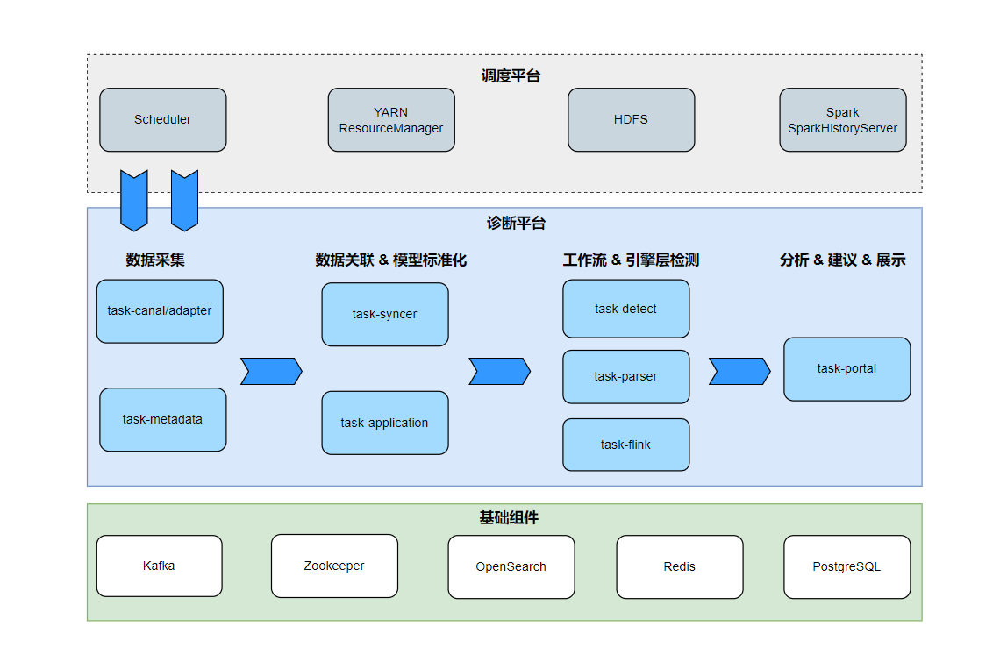

# Compass(罗盘) 系统设计文档

## 相关文章

[OPPO大数据诊断平台设计与实践](https://mp.weixin.qq.com/s/Bkw_pN_CSIOtepN2LrjcLQ)

## 系统架构

### 系统架构图

### 架构说明

整体架构分3层：

- 调度系统对接层：实现对接调度器、Yarn、Spark、Flink、HDFS等系统，同步任务及其日志元数据到诊断系统；

- 服务层：包括数据采集、元数据关联&模型标准化、异常检测、资源诊断、Portal模块；

- 基础组件层：包括MySQL、 OpenSearch、Kafka、Redis、Zookeeper等组件。

具体模块流程阶段：

- 数据采集阶段：task-canal/adapter模块订阅同步调度系统的用户、DAG、作业、执行记录等工作流元数据同步至诊断平台；task-metadata模块定时同步Yarn ResourceManager、Spark HistoryServer App元数据至诊断系统，关联日志存储路径，为后续数据处理阶段作基础；

- 数据关联与模型标准化阶段：task-syncer模块将同步的数据标准化为User、Project、Flow、Task、TaskInstance模型；task-application模块将工作流层与引擎层元数据关联；

- 工作流层&引擎层异常检测阶段：至此已经获得数据标准模型，针对标准模型进一步Workflow异常检测流程。task-detect模块进行工作流层异常任务检测，例如运行失败、基线耗时异常等；task-parser模块进行引擎层异常任务检测，例如SQL失败、Shuffle失败等；task-flink模块进行flink作业资源及异常检测，例如cpu利用率低，内存利用率低等；

- 业务视图：task-portal模块提供用户报告总览、一键诊断、工作流层任务诊断、引擎层作业Application诊断、诊断建议和详细报告、白名单等功能。

更多细节请参考[部署指南](./deployment.md)

