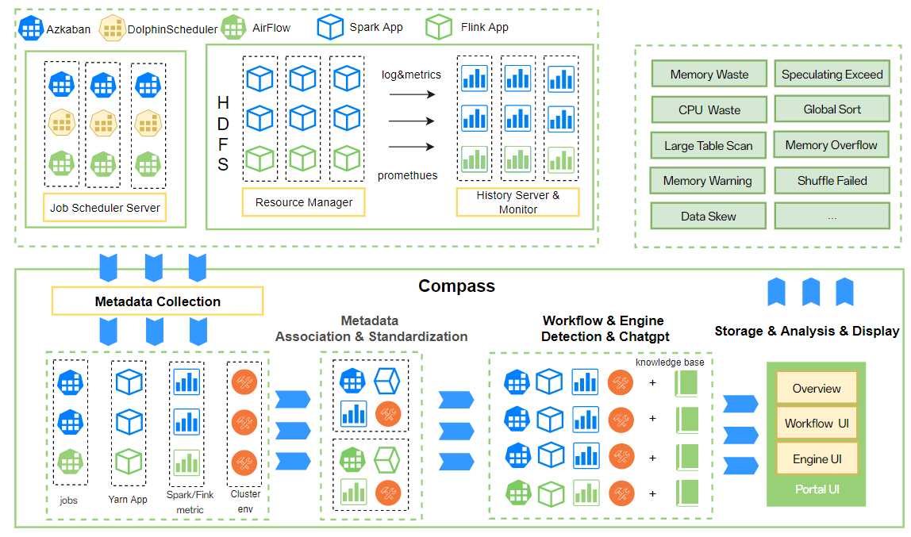
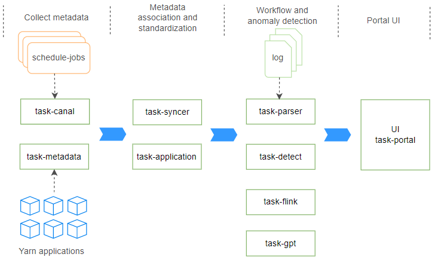

# System Design Document

## System Architecture

### System Architecture Diagram

### Architecture Description

The overall architecture is divided into 3 layers:

- Scheduling System Docking Layer: Implements docking with schedulers, Yarn, Spark, Flink, HDFS and other systems, synchronizing tasks and their log metadata to the diagnostic system;

- Service Layer: Includes data collection, metadata association & model standardization, anomaly detection, resource diagnosis, Portal module;

- Basic Component Layer: Includes MySQL, OpenSearch, Kafka, Redis, Zookeeper and other components.

Specific module process stages:

- Data Collection Stage: The task-canal/adapter module subscribes to synchronize the user, DAG, job, execution record and other workflow metadata of the scheduling system to the diagnostic platform; the task-metadata module periodically synchronizes Yarn ResourceManager, Spark HistoryServer App metadata to the diagnostic system, associating log storage paths, as a basis for subsequent data processing stages;

- Data Association and Model Standardization Stage: The task-syncer module standardizes the synchronized data into User, Project, Flow, Task, TaskInstance models; the task-application module associates workflow layer and engine layer metadata;

- Workflow Layer & Engine Layer Anomaly Detection Stage: At this point, the standard data model has been obtained, and further Workflow anomaly detection processes are carried out for the standard model. The task-detect module performs workflow layer anomaly task detection, such as `Failed task`, `Abnormal time-elapsed task`, etc.; the task-parser module performs engine layer anomaly task detection, such as `Failed SQL task`, `Shuffle failed task`, etc.; the task-flink module performs flink job resource and anomaly detection, such as `Low CPU usage`, `Low memory usage`, etc.;

- Business View: The task-portal module provides user report overview, one-click diagnosis, workflow layer task diagnosis, engine layer job Application diagnosis, diagnostic suggestions and detailed reports, whitelist and other functions.

For more details, please refer to [deployment document](./deployment.md)

