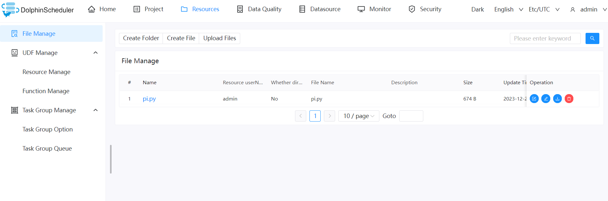
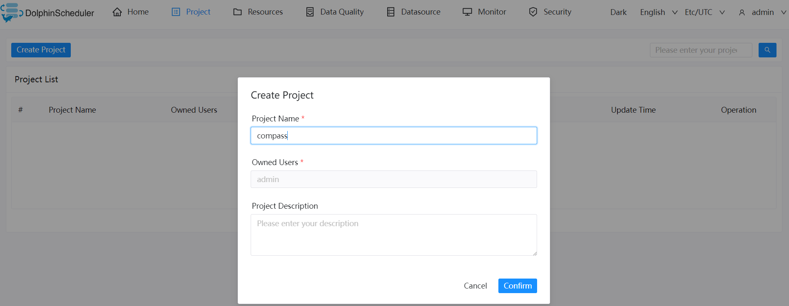
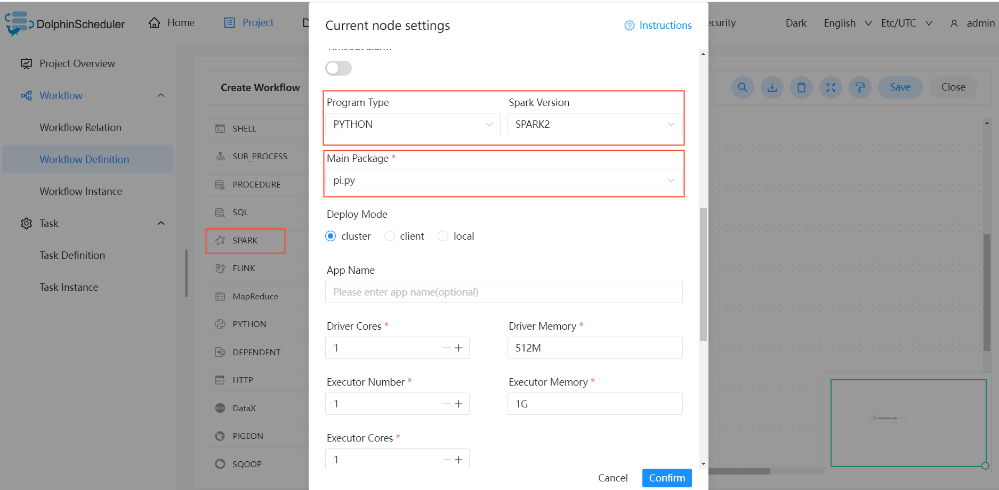

# Run DolphinScheduler example

DolphinScheduler Web UI : http://localhost:12345/dolphinscheduler

Login Username & Password: admin / dolphinscheduler123

1. Create File Resources



pi.py example

```shell
import sys
from random import random
from operator import add

from pyspark.sql import SparkSession


if __name__ == "__main__":
    """
        Usage: pi [partitions]
    """
    spark = SparkSession\
        .builder\
        .appName("PythonPi")\
        .getOrCreate()

    partitions = int(sys.argv[1]) if len(sys.argv) > 1 else 2
    n = 100000 * partitions

    def f(_: int) -> float:
        x = random() * 2 - 1
        y = random() * 2 - 1
        return 1 if x ** 2 + y ** 2 <= 1 else 0

    count = spark.sparkContext.parallelize(range(1, n + 1), partitions).map(f).reduce(add)
    print("Pi is roughly %f" % (4.0 * count / n))
    spark.stop()
    sys.exit(-1)
```

2. Create project and spark workflow definition




Save workflow and change tenant to root


3. Online and start pi workflow
